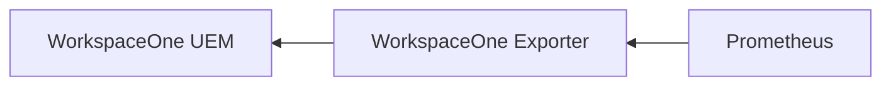

# WorkspaceOne Prometheus Exporter

WorkspaceOne UEM Prometheus exporter

## Description

This exporter is used to export WorkspaceOne UEM value to [OpenMetrics](https://openmetrics.io/) format.

## Accessing the metrics

- Default port: 9740
- Endpoint: /metrics

example: `http://localhost:9740/metrics`

## Metrics

| Metric | Description | Labels | Type | Implemented |
| ------ | ----------- | ------ | ---- | ----------- |
| `api_calls` | The number of API calls made to the WS1 tenant | `none` | Counter | ✅ |
| `devices_number` | The number of devices in the WS1 tenant | `none` | Gauge | ✅ |
| `devices_os` | The number of devices per OS in the WS1 tenant | `os` | Gauge | ✅ |
| `devices_offline` | The number of devices in the WS1 tenant that are offline | `none` | Gauge | ✅ |
| `devices_online` | The number of devices in the WS1 tenant that are online| `none` | Gauge | ✅ |
| `tags_sum`| The number of tags in the WS1 tenant | `none` | Gauge | ✅ |
| `devices_online_tag`| The number of devices online per tag in the WS1 tenant| `tag`, `model` | Gauge | ✅ |
| `devices_offline_tag`| The number of devices offline per tag in the WS1 tenant | `tag`, `model` | Gauge | ✅ |
| `devices_offline_1m_tag` | The number of devices offline per tag in the WS1 tenant for more than the last month | `tag`, `model` | Gauge | ✅ |

## Environment variables

| Variable | Description | Type | Comment |
| -------- | ----------- | ---- | ------- |
| `WS1_AUTH_KEY` | WorkspaceOne UEM user Auth Key | `string`| |
| `WS1_TENANT_KEY` | WorkspaceOne UEM tenant key | `string`| |
| `WS1_URL` | WorkspaceOne UEM base API URL endpoint, must finished by /API | `string`| |
| `WS1_LGID` | WorkspaceOne UEM highest Group ID | `string`| |
| `WS1_INTERVAL` | Interval between each WS1 check to it's enrolled devices in minutes | `string`| |
| `TAG_PARSING` | Enable or disable the tag parsing | `string`| must be true of false |
| `TAG_FILTER` | String to filter Tag by it | `string`| Will apply a regex filter using this string over all tags |
| `INSECURE` | Enable or disable the TLS verification | `string`| must be true of false |

## FlowChart



## Usage

## Filter by Tag

You can filter the devices by tag by using the `TAG_FILTER` environment variable.
It will enable the system to only keep the tags that contain the string you set.


### Running it locally

```bash
go run ./...
```

### Run it as a Docker container

```bash
docker build -t w1-prometheus-exporter .
docker run -d -p 9740:9740 w1-prometheus-exporter
```

## Useful links

- [WorkspaceOne UEM API Reference](https://docs.vmware.com/en/VMware-Workspace-ONE-UEM/services/UEM_ConsoleBasics/GUID-BF20C949-5065-4DCF-889D-1E0151016B5A.html)
- [WorkspaceOne UEM API Explorer](https://as1506.awmdm.com/api/help/)
- [WorkspaceOne API doc pdf (UEM 9.1), is old but still has more interesting details](./doc/VMware%20AirWatch%20REST%20API%20v9_1.pdf)
